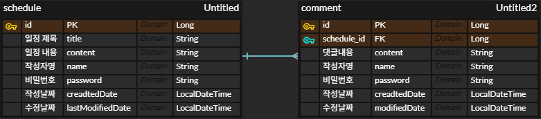

# Schedule & Comment CRUD Project

> **Spring Boot + JPA 기반의 일정 관리 프로젝트**  
> 일정(Schedule)과 댓글(Comment)을 관리할 수 있는 RESTful API 서버입니다.

---

## 프로젝트 개요

이 프로젝트는 **일정 등록, 조회, 수정, 삭제** 기능과  
각 일정에 **댓글을 추가, 조회, 삭제**할 수 있는 기능을 제공합니다.

단방향 매핑(`Comment → Schedule`) 이라고 생각하여 간결하게 작성해보았습니다.

---

## Tech Stack

| 구분 | 사용 기술              |
|------|--------------------|
| Language | Java 17            |
| Framework | Spring Boot 3.x    |
| ORM | Spring Data JPA    |
| DB | MySQL              |
| Build Tool | Gradle             |
| IDE | IntelliJ IDEA      |

---

## ERD 설계

```text
(N) Comment ────▶ Schedule (1) 
```

| Schedule         | Comment          |
| ---------------- | ---------------- |
| id (PK)          | id (PK)          |
| title            | content          |
| content          | name             |
| name             | password         |
| password         | createdDate      |
| createdDate      | modifiedDate     |
| lastModifiedDate | schedule_id (FK) |

---


---

# API 명세서

## Schedule

| 기능       | Method     | URL               | Request                                | Response  |
| -------- | ---------- | ----------------- | -------------------------------------- | --------- |
| 일정 생성    | **POST**   | `/schedules`      | `title`, `content`, `name`, `password` | 생성된 일정 정보 |
| 일정 전체 조회 | **GET**    | `/schedules`      | -                                      | 일정 리스트    |
| 일정 단건 조회 | **GET**    | `/schedules/{id}` | -                                      | 일정 상세 정보  |
| 일정 수정    | **PUT**    | `/schedules/{id}` | `title`, `content`, `password`         | 수정된 일정 정보 |
| 일정 삭제    | **DELETE** | `/schedules/{id}` | `password`                             | 삭제 완료 메시지 |

## Comment
| 기능    | Method     | URL                                    | Request                       | Response  |
| ----- | ---------- | -------------------------------------- | ----------------------------- | --------- |
| 댓글 작성 | **POST**   | `/schedules/{id}/comments`             | `content`, `name`, `password` | 생성된 댓글    |
| 댓글 조회 | **GET**    | `/schedules/{id}/comments`             | -                             | 댓글 리스트    |
| 댓글 삭제 | **DELETE** | `/schedules/{id}/comments/{commentId}` | `password`                    | 삭제 완료 메시지 |

---
## POSTMAN 예시

> 실제 API 테스트 시 참고할 수 있는 예시입니다.

---

### 일정 생성 (Create Schedule)

**POST** `/schedules`

#### Request Body
```json
{
  "title": "스터디 회의",
  "content": "이번 주 회의 일정입니다.",
  "name": "용준",
  "password": "1234"
}
 Response Body
json
{
  "id": 1,
  "title": "스터디 회의",
  "content": "이번 주 회의 일정입니다.",
  "name": "용준",
  "createDate": "2025-11-06T10:15:30",
  "lastModifiedDate": "2025-11-06T10:15:30"
}

일정 단건 조회 (Get One Schedule)
GET /schedules/1

Response Body
json
{
  "id": 1,
  "title": "스터디 회의",
  "content": "이번 주 회의 일정입니다.",
  "name": "용준",
  "createDate": "2025-11-06T10:15:30",
  "lastModifiedDate": "2025-11-06T10:15:30",
  "comments": [
    {
      "id": 1,
      "content": "확인했습니다!",
      "name": "홍길동",
      "createdDate": "2025-11-06T11:00:00",
      "modifiedDate": "2025-11-06T11:00:00"
    }
  ]
}
댓글 작성 (Create Comment)
POST /schedules/1/comments

Request Body
json
{
  "content": "이번 회의 내용 공유 부탁드려요.",
  "name": "철수",
  "password": "abcd"
}
Response Body
json
{
  "id": 1,
  "content": "이번 회의 내용 공유 부탁드려요.",
  "name": "철수",
  "createdDate": "2025-11-06T11:10:00",
  "modifiedDate": "2025-11-06T11:10:00"
}
예외 응답 (Validation & CustomException)

 예시 1 — Validation 실패
json
{
  "status": 400,
  "error": "Bad Request",
  "message": "제목을 입력해 주십시오.",
  "path": "/schedules"
}

 예시 2 — CustomException
json
{
  "status": 400,
  "error": "Bad Request",
  "message": "존재하지 않는 일정 아이디 입니다.",
  "path": "/schedules/99"
}


---

주요 구현 내용

@EnableJpaAuditing을 활용한 작성일 / 수정일 자동 관리

@Valid와 @NotBlank를 통한 입력 값 검증

DTO 분리 (Request, Response 클래스 구성)

단방향 연관관계 (Comment → Schedule) 적용

Service, Controller, Repository의 3-Layer 구조


---

📁 프로젝트 구조
src
└─ main
├─ java/com/schedule_project
│   ├─ controller
│   ├─ dto
│   │   ├─ schedule
│   │   └─ comment
│   ├─ entity
│   ├─ repository
│   ├─ service
│   └─ exception
└─ resources
├─ application.yml
└─ data.sql

